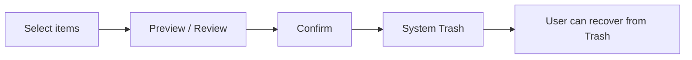

# DiskWise for Android (Photos / Gallery)

On-device **gallery storage consultant**: scan MediaStore, surface reclaimable space, recommend safe cleanup, and move selected items to **Trash**.

## Product scope (v1)

| In scope | Out of scope |
|----------|----------------|
| Local gallery via MediaStore (images + videos) | Files app / Downloads browser |
| Exact duplicates (size + dimensions + duration) | Similar-media near-copies |
| Clutter buckets (screenshots, large videos, older media) | WhatsApp / third-party app folders |
| Insights + ranked recommendations | Background auto-delete |
| Preview + confirm → system Trash | Emptying Trash / permanent purge |

## Privacy

- All analysis runs **on-device**.
- No path, thumbnail, or photo content is uploaded.
- Requires **Photos and videos** read access; delete uses the system `createDeleteRequest` confirmation on Android 11+.

## Safety model



Destructive actions use `MediaStore.createDeleteRequest` (API 30+) so the OS shows the Trash confirmation. v1 never empties Trash.

## Architecture

| Layer | Owns |
|-------|------|
| `data/` | MediaStore index, duplicate/insight engines, cleanup |
| `ui/` | Compose screens + `DiskWiseViewModel` |
| `MainActivity` | Permissions + Trash intent sender |

## Package

`net.suherman.diskwise.android`

## Build

```bash
npm run build:android
# release AAB (requires app/DiskWiseAndroid/keystore.properties):
npm run build:android:bundle
```

## Play Console

| Field | Value |
|-------|-------|
| Application ID | `net.suherman.diskwise.android` |
| Play app id | `4975355557632156100` |
| Privacy | https://diskwise.suherman.net/#privacy |
| Support | https://diskwise.suherman.net |
| Contact | iman.suherman@gmail.com |

Listing draft: `play-console/listing.json`  
Release status: `play-console/play-status.json`

### Published so far

- **Internal testing** — versionCode **3** (`1.0.0`) available to internal testers (temporary unreviewed name until store listing + first review complete).

### Still required for production / Play Store listing

1. Add internal tester emails (Play Console → Internal testing → Testers).
2. Complete **App content** (Data safety, Ads = No, target audience, content rating).
3. Store listing: short/full description, icon, feature graphic, phone screenshots.
4. Privacy policy URL on the store listing (already hosted).
5. Promote internal → closed testing or production and send for review.

Console: https://play.google.com/console/u/0/developers/8591860321759482577/app/4975355557632156100
