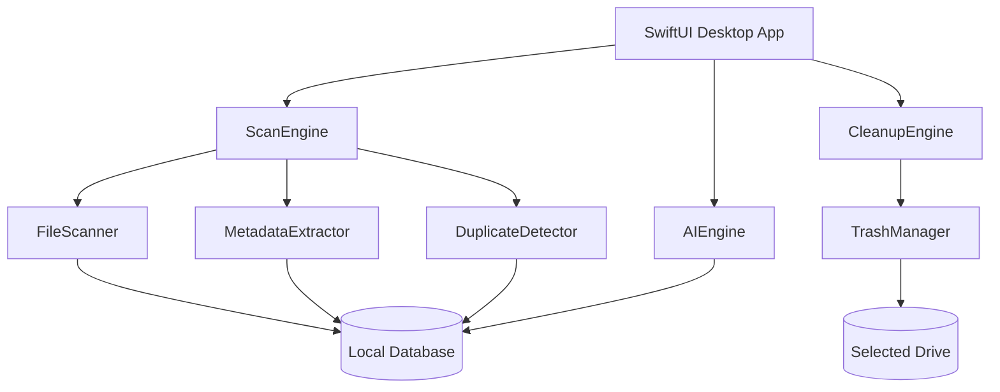

# Architecture

DiskWise is a native macOS storage intelligence application built with SwiftUI and modular Swift packages.

## High-level flow

## Module boundaries

| Module | Responsibility |
|--------|----------------|
| `DiskScannerKit` | Volume crawl, file classification, scan persistence |
| `MetadataKit` | AVFoundation/ImageIO metadata extraction |
| `DuplicateKit` | Filename, size, hash, and video fingerprint duplicate detection |
| `CleanupKit` | Preview and Trash-based cleanup workflow |
| `AIKit` | Rule-based insights and optional Ollama report generation |
| `DatabaseKit` | GRDB schema, migrations, query layer |

## Duplicate detection levels

1. **Filename** — normalized basename matching (`movie.mp4`, `movie (1).mp4`)
2. **Size** — identical byte size grouping
3. **Hash** — SHA256 verification for exact duplicates
4. **Video fingerprint** — sampled frame perceptual hash + duration/resolution signature

## Cleanup safety model

Cleanup never permanently deletes files by default. All destructive actions use `FileManager.trashItem(at:resultingItemURL:)`.

## IDE workflow

- **VS Code** — primary editing, Git, AI agents
- **Xcode** — UI preview, archive, signing, notarization, DMG

Swift compiler, macOS SDK, and signing tools always come from Xcode even when coding in VS Code.

## Future: Media Intelligence Engine

Phase 2+ adds deeper media understanding:

- Preview/sidecar/transcode detection
- Content fingerprinting for renamed videos
- Large-library optimization tuned for multi-TB external drives

## Future: Local LLM integration

Phase 4 connects to Ollama for natural-language reports:

> Analyze my 18 TB media drive and identify what can be safely removed.

The app sends structured scan summaries to a local model and renders a consultant-style optimization plan.
