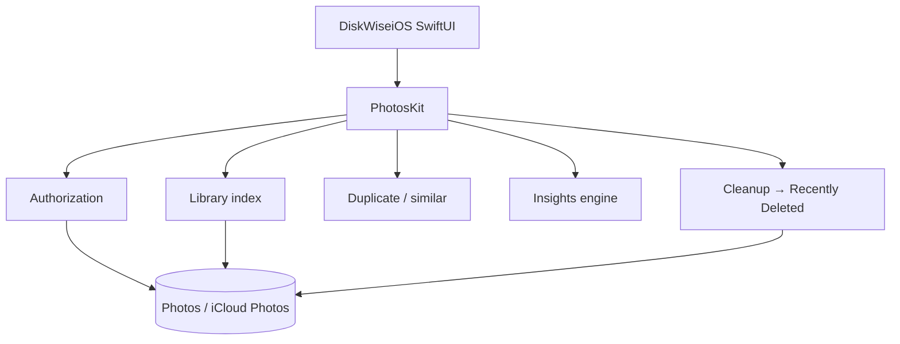

# DiskWise for iPhone & iPad (Photos)

On-device **Photos storage consultant**: scan the photo library, surface reclaimable space, recommend safe cleanup, and move selected items to **Recently Deleted**.

## Product scope (v1)

| In scope | Out of scope |
|----------|----------------|
| Local + iCloud Photos via PhotoKit | Files app / iCloud Drive browsing |
| Exact + near-duplicate media | WhatsApp / third-party app folders |
| Clutter buckets (screenshots, bursts, large videos, old media) | Shared album editing |
| Insights + ranked recommendations | Background auto-delete |
| Preview → confirm → Recently Deleted | Permanent purge from Recently Deleted |
| Universal iPhone + iPad (SwiftUI) | macOS Photos library control |

## Privacy

- All analysis runs **on-device**.
- No path, thumbnail, or photo content is uploaded.
- Requires **Photo Library read/write** so cleanup can move assets to Recently Deleted.
- Supports Limited Photo Library; full access recommended for accurate reclaimable estimates.

## Safety model


Destructive actions use `PHAssetChangeRequest.deleteAssets` only. v1 never empties Recently Deleted.

## Architecture



| Module | Owns |
|--------|------|
| `PhotosKit` | Authorization, indexing, duplicates, insights, cleanup APIs |
| `app/DiskWiseiOS` | SwiftUI consultant UI, permissions UX, localization |

macOS kits (`DiskScannerKit`, etc.) stay path/volume oriented and are **not** reused for Photos.

## MVP checklist

- [ ] Grant Photos access (full recommended; limited supported)
- [ ] Dashboard shows reclaimable estimate and buckets after scan
- [ ] Open a bucket → preview → confirm → items appear in Photos → Recently Deleted
- [ ] ~10k library: scan + first cleanup path completes in under ~5 minutes
- [ ] No network upload of photo content (on-device only)

## Build

```bash
npm run build:ios
# or:
cd app && xcodegen generate
xcodebuild -project DiskWise.xcodeproj -scheme DiskWiseiOS \
  -destination 'platform=iOS Simulator,name=iPhone 16' build
```

Open `app/DiskWise.xcodeproj` and run the **DiskWiseiOS** scheme on a simulator or device.

## App Store Connect (ArahBaik / HaloRT mechanism)

| Field | Value |
|-------|-------|
| Bundle ID | `net.suherman.diskwise.ios` |
| Team | `Q3TXW887NM` |
| Signing | Automatic |
| ASC credentials | `halort-infra/.credentials/asc/` |

```bash
npm run asc:ensure          # create Bundle ID + ASC app if needed
npm run publish:testflight  # archive + upload IPA
```

Status is written to `app-store-connect/testflight-status.json` after a successful upload.
